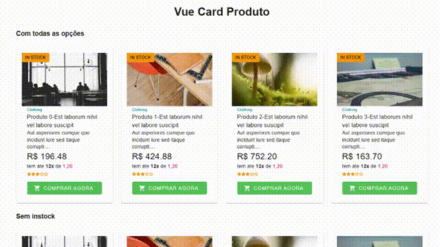

# V-Card-Produto
Card de exibição de produto com layout moderno e responsivo. Exibe imagem do produto, status de estoque, categoria, nome, descrição curta, preço, condições de parcelamento, avaliação por estrelas e botão de compra destacado. Ideal para vitrines de e-commerce e páginas de listagem de produtos.


## Funcionalidades
* Duas imagens do produto com carregamento lazy.
* Destaque de disponibilidade com v-chip.
* Título, descrição curta e valor formatado.
* Avaliação com v-rating.
* Botão de compra com ícone de carrinho.
* Comportamento responsivo com suporte a layout exclusivo ou completo.


## Install 
#### NPM 
Para usar o componente em seu projeto Vue 3, instale o pacote via NPM:

```bash 
npm install v-card-produto
``` 

## Props

| Prop               | Tipo      | Descrição                                                                |
| ------------------ | --------- | ------------------------------------------------------------------------ |
| `item`             | `Object`  | Objeto contendo `src`, `src2`, `titulo`, `descricao`, `valor`, `rating`. |
| `theme`            | `String`  | Tema do Vuetify (`light`, `dark`, etc).                                  |
| `classe`           | `String`  | Classes CSS adicionais aplicadas ao `v-card`.                            |
| `elevation`        | `Number`  | Nível de sombra do card (`0` a `24`).                                    |
| `toggle_exclusive` | `Boolean` | Alterna entre layout com iamgem a direita (`true`) ou imagem no topo(`false`).        |
| `show_instock`     | `Boolean` | Exibe ou oculta o selo de disponibilidade.                               |
| `text_instock`     | `String`  | Texto do selo de disponibilidade.                                        |
| `color_instock`    | `String`  | Cor do selo de disponibilidade.                                          |
| `show_header`      | `Boolean` | Exibe ou oculta o cabeçalho pequeno antes do título.                     |
| `text_header`      | `String`  | Texto do cabeçalho.                                                      |
| `color_header`     | `String`  | Cor do texto do cabeçalho.                                               |
| `show_valor`       | `Boolean` | Exibe ou oculta o valor do produto.                                      |
| `show_rating`      | `Boolean` | Exibe ou oculta a avaliação (estrelas).                                  |
| `color_rating`     | `String`  | Cor das estrelas de avaliação.                                           |
| `show_buy`         | `Boolean` | Exibe ou oculta o botão de compra.                                       |
| `text_buy`         | `String`  | Texto exibido no botão de compra.                                        |
| `color_buy`        | `String`  | Cor do botão de compra.                                                  |


## Eventos
 
| Evento   | Descrição                                  |
| -------- | ------------------------------------------ |
| `@click` | A ação de clique redireciona via `goTo()`. |

## Slots

| Slot              | Descrição                                         |
| ----------------- | ------------------------------------------------- |
| `extra_txt_valor` | Slot para inserir conteúdo extra abaixo do valor. |

# Uso
No seu projeto Vue, importe e registre o componente:

## Exemplo de Uso
Você pode usar o componente da seguinte maneira:

```vue
<template>
   <VCardProduto :item="item" @goTo="gotTo" >
      <template v-slot:extra_txt_valor>
      tem ate <b>12x</b> de <span style='color: red'>1,20</span>
      </template>
   </VCardProduto>
</template>

<script>
import { defineComponent } from 'vue';

export default defineComponent({
data:()=>({
    item: {
      src: `https://picsum.photos/400/200?random=1`,
      src2: `https://picsum.photos/400/200?random=2`,
      valor: 100.00,
      rating: 5,
      titulo: 'Nome do Produto',
      descricao: 'Descrição do produto',
    }
  }),
   methods: {
      gotTo(item){           
             var titulo = item.titulo.replaceAll(' ', '-').toLowerCase()
             router.push({name: 'routeName', params: {item: titulo}}).catch(err => {
             })
           },
   },
});
</script>

```


#### Estilo e Responsividade
* Responsivo com base no v-row e v-col do Vuetify
* Adapta automaticamente o número de colunas baseado na quantidade de arquivos

## Dependências
* Vue 3
* Vuetify 3
* Material Design Icons (para ícones como mdi-delete, mdi-upload etc.)

